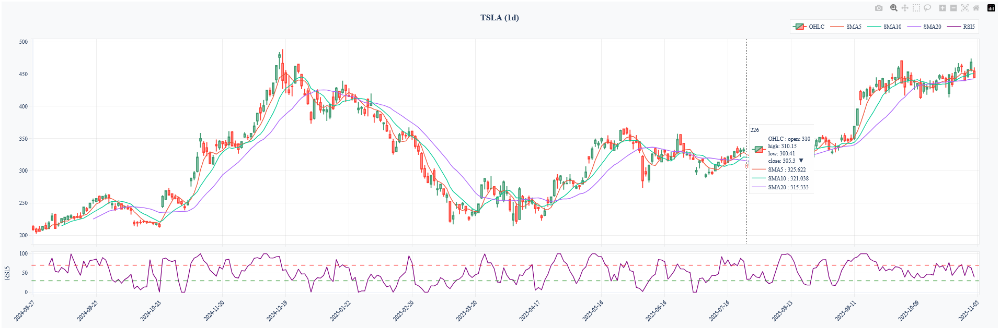

# QuanTa

Finance-grade technical analysis toolkit powered by [Polars](https://www.pola.rs/), [Plotly](https://plotly.com/python/), and [Optuna](https://optuna.org/).


QuanTa centralises everything needed to explore technical indicators, chart market data, and optimise trading strategies. It provides a clean API to fetch OHLCV data, compose sophisticated charts, and run automated hyper-parameter searches for your strategies.

---

## Key Features

- **Fast market data handling** with Polars-based `YahooFinanceClient`.
- **Comprehensive indicator library** with a consistent `Indicator` interface:
  - **Trend indicators**: SMA, EMA, Bollinger Bands, MACD, ADX
  - **Momentum oscillators**: RSI, Stochastic, Williams %R, CCI
  - **Volatility measures**: ATR, Volatility (historical)
  - **Pattern recognition**: Engulfing Pattern (Bullish/Bearish)
- **Interactive charting** via Plotly with configurable overlays, subplots, trade annotations, and PnL visualization.
- **Risk analysis** with `RiskClient` for VaR (Value at Risk) and ES (Expected Shortfall) calculations.
- **Strategy optimisation** through Optuna with:
  - Flexible configuration (indicators, strategy parameters, signal parameters)
  - Constraint management
  - Multiple optimization targets (Sharpe Ratio, Total Return, CAGR, Max Drawdown)
  - Automatic direction detection (maximize/minimize)
- **PnL visualization**: Cumulative P&L curves and separate distribution charts with risk metrics.
- **Ready-to-run notebooks** showcasing optimisation workflows and strategy exploration.
- **Ergonomic CLI** to fetch/memoize Yahoo Finance data, inspect caches, and plot charts with optional indicators.

---

## Getting Started

### Prerequisites

- Python 3.11 or higher  
- [Poetry](https://python-poetry.org/docs/#installation) for dependency management

### Installation

```bash
git clone https://github.com/<your-account>/QuanTa.git
cd QuanTa
poetry install
```

Spawn a shell with the environment activated:

```bash
poetry shell
```

---

## Usage Examples

### CLI quick start

The CLI (shipped as `python -m quanta.cli`) wraps the main flows:

1. **Fetch & cache data**

   ```bash
   poetry run python -m quanta.cli fetch AAPL \
       --from 2023-01-01 \
       --to   2023-12-31 \
       --interval 1h
   ```

   - Cached datasets are stored under the key `SYMBOL-interval` by default (`AAPL-1h` above).  
   - Re-running `fetch` for the same key *merges* new rows with the existing cache instead of overwriting it.

2. **Inspect caches**

   ```bash
   poetry run python -m quanta.cli cache --ticker
   ```

   Displays a Rich table with interval, row count, unique trading days, and last update for each cache key.

3. **List applied indicators**

   ```bash
   poetry run python -m quanta.cli cache --indicators
   ```

   Useful to see which TA enrichments have been stored for each dataset.

4. **Plot**

   ```bash
   poetry run python -m quanta.cli plot \
       --cache-key AAPL-1h \
       --symbol-name "AAPL (1h)" \
       --indicator SMA:period=50 --indicator RSI
   ```

   - `--symbol-name / -n` labels the Plotly figure.  
   - Indicators are optional; none are drawn unless you pass `--indicator`.
   - To add multiple indicators quickly, use comma-separated values: `--indicator SMA50,RSI14,Volatility15`.
   - You can mix indicator names (e.g., `SMA50`) and indicator classes (e.g., `RSI`).
   - Example output:

     

5. **Add indicators to cached data**

   ```bash
   poetry run python -m quanta.cli ta SMA \
       --source AAPL-1h \
       --param 10
   ```

   The shorthand `--param 10` is equivalent to `--param period=10`. Use `--param key=value` for additional parameters.
   
   For indicators with multiple parameters, use comma-separated values:
   ```bash
   poetry run python -m quanta.cli ta Stochastic \
       --source AAPL-1h \
       --param 14,3,3  # k_period, k_slow, d_period
   ```
   
   Or use named parameters:
   ```bash
   poetry run python -m quanta.cli ta Volatility \
       --source AAPL-1h \
       --param 20,False,close  # period, annualize, price_column
   ```

6. **List available indicators**

   ```bash
   poetry run python -m quanta.cli cache --available-indicators
   ```

   Displays a stylized Rich table with all available indicators, their descriptions, default parameters, and generated column names.

### Fetch and Plot Market Data

```python
import polars as pl
from quanta.clients.yfinance import YahooFinanceClient
from quanta.clients.chart import ChartClient
from quanta.utils.ta import SMA, RSI, MACD

# 1. Download OHLCV data
client = YahooFinanceClient()
df = client.get_price("AAPL", from_date="2023-01-01", to_date="2024-12-31", interval="1d")

# 2. Prepare indicators and plot
ta_indicators = [SMA(50), SMA(200), RSI(), MACD()]
chart = ChartClient()
chart.plot(df, symbol="AAPL", indicators=ta_indicators)
```

### Run a Strategy Optimisation

```python
import json
from quanta.ta_clients.optimization import OptimizationClient
from quanta.ta_clients.optimization_strategy import OPTIMIZATION_CONFIG, StrategyClient

# Optionally load/modify the base configuration
config = json.loads(json.dumps(OPTIMIZATION_CONFIG))

# Configure optimization target (auto-determines direction)
config["optimization"]["target"] = "sharpe_ratio"  # or "max_drawdown", "total_return", "cagr"
config["optimization"]["n_trials"] = 200

# Initialize optimizer
optimizer = OptimizationClient(config)

# Get strategy function
strategy_client = StrategyClient()
strategy_func = strategy_client.get_strategy_fct("simple_strategy")

# Run optimization
study = optimizer.optimize(
    backtest_func=strategy_func,
    df=df,  # Your DataFrame with OHLCV data
    verbose=True
)

# Access results
best_params = study.best_params
best_value = study.best_value
print(f"Best {config['optimization']['target']}: {best_value:.4f}")

# Save results
optimizer.save_results(output_dir="./results")
```

### Calculate Risk Metrics (VaR & ES)

```python
from quanta.clients.risk import RiskClient
import polars as pl

# Assuming you have a trades DataFrame with 'pnl' column
risk_client = RiskClient()

# Calculate comprehensive risk metrics
metrics = risk_client.calculate_risk_metrics(trades_df['pnl'])

print(f"VaR 95%: {metrics['VaR_95_historical']:.4f}")
print(f"ES 95%: {metrics['ES_95_historical']:.4f}")
print(f"Mean: {metrics['mean']:.4f}")
print(f"Std: {metrics['std']:.4f}")
```

### Plot PnL Distribution with Risk Metrics

```python
from quanta.clients.chart import ChartClient

chart = ChartClient()

# Plot temporal charts (price, indicators, cumulative P&L)
chart.plot(df, symbol="AAPL", trades_df=trades_df, indicators=[SMA(50), RSI()])

# Plot separate PnL distribution with VaR/ES
chart.plot_pnl_distribution(trades_df, symbol="AAPL")
```

### Available Indicators

```python
from quanta.utils.ta import (
    SMA, EMA, RSI, MACD, BollingerBands, ATR, Volatility,
    Stochastic, WilliamsR, CCI, ADX, EngulfingPattern
)

# Trend indicators
indicators = [
    SMA(50),
    EMA(12),
    BollingerBands(period=20, std_dev=2.0),
    ADX(14)
]

# Momentum oscillators
oscillators = [
    RSI(14),
    Stochastic(k_period=14, k_slow=3, d_period=3),
    WilliamsR(14),
    CCI(14)
]

# Volatility & Patterns
volatility = [ATR(14), Volatility(period=20, annualize=True)]
patterns = [EngulfingPattern(separate_columns=False)]
```

---

## Project Structure

```text
QuanTa/
├── quanta/
│   ├── clients/            # Data providers, charting & risk analysis
│   │   ├── yfinance.py     # Yahoo Finance data fetching
│   │   ├── chart.py         # Plotly charting with PnL visualization
│   │   └── risk.py          # Risk metrics (VaR, ES)
│   ├── ta_clients/         # Strategy optimisation logic and configs
│   │   ├── optimization.py # Optuna-based optimization engine
│   │   └── optimization_strategy.py  # Strategy definitions & configs
│   ├── utils/              # Indicators, plotting traces, shared utilities
│   │   ├── ta.py           # Technical indicators library
│   │   └── trace.py        # Plotly trace definitions
│   └── cli/                # Command-line interface
├── notebooks/              # Exploratory notebooks (optimisation, strategy tests)
├── best_config.json        # Example Optuna best-run snapshot
├── optimization_results.csv# Historical optimisation exports
├── pyproject.toml          # Poetry project metadata
└── README.md
```

---

## Notebooks (Clean Examples)

- `notebooks/optim.ipynb` – Curated walk-through of a simple SMA/RSI optimisation, cleaned and ready to run.  
- `notebooks/optim_long_short.ipynb` – Polished long/short exploration showcasing constraint handling.

Both notebooks are maintained as production-ready examples. Launch them in Jupyter or VS Code after installing dependencies:

```bash
poetry run jupyter lab notebooks/
```

---

## Strategy Configuration

The optimization configuration is structured into three main sections:

### 1. Indicators (`indicators`)
Technical indicators to optimize (SMA, RSI, MACD, ATR, Bollinger Bands, ADX, Stochastic, WilliamsR, CCI, EngulfingPattern).

### 2. Strategy Parameters (`strategy`)
Risk management parameters: `stop_loss`, `take_profit`, `position_size`.

### 3. Signal Parameters (`signals`)
Conditions for opening/closing positions: `macd_hist_buy_threshold`, `macd_hist_sell_threshold`, `adx_threshold`, `use_engulfing`.

### Optimization Target
Configure the metric to optimize:
- `"target": "sharpe_ratio"` → maximize (default)
- `"target": "total_return"` → maximize
- `"target": "cagr"` → maximize
- `"target": "max_drawdown"` → minimize (auto-detected)

The direction (maximize/minimize) is automatically determined based on the target metric.

## Risk Analysis

QuanTa includes a `RiskClient` for calculating risk metrics:

- **VaR (Value at Risk)**: Maximum potential loss at a given confidence level
  - Methods: Historical, Parametric, Monte Carlo
- **ES (Expected Shortfall)**: Average loss given that loss exceeds VaR
  - Methods: Historical, Parametric
- **Distribution Analysis**: Histogram with VaR/ES lines and statistics

## Roadmap

- Add unit tests & CI to ensure indicator correctness.
- Expand indicator catalogue (Ichimoku, Heikin Ashi, volume profile, …).
- Provide reusable CLI/REST endpoints for live usage.
- Publish pre-built dashboards and extend documentation.
- Multi-objective optimization (Pareto front).
- Walk-forward optimization support.

Feel free to open issues or discussions for feature requests!

---

## Contributing

1. Fork the repository and create your branch (`git checkout -b feature/my-feature`).  
2. Install dependencies (`poetry install`) and keep the code formatted.  
3. Commit with clear messages and open a pull request describing your changes.

---

## Contact

- **Author**: Mileto 
- **LinkedIn**: Share your feedback or showcase what you build with QuanTa – tag the project to spread the word!

If you use QuanTa in your trading research or dashboards, I’d love to hear about it. Happy analysing!
